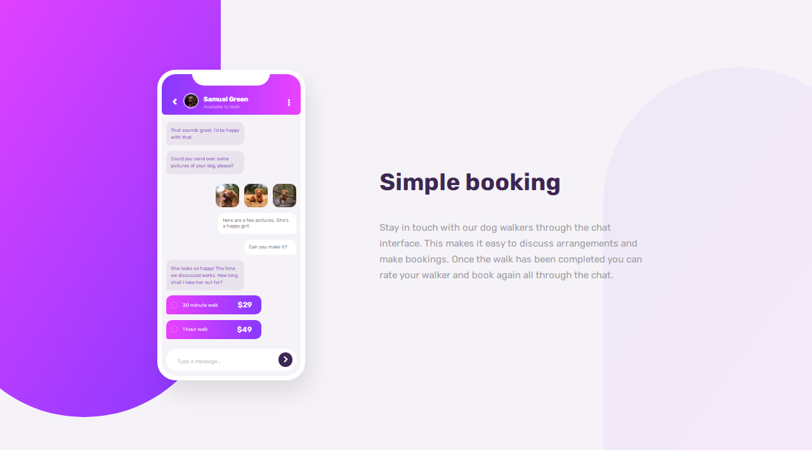

# Frontend Mentor - Chat app CSS illustration solution

This is a solution to the [Chat app CSS illustration challenge on Frontend Mentor](https://www.frontendmentor.io/challenges/chat-app-css-illustration-O5auMkFqY). Frontend Mentor challenges help you improve your coding skills by building realistic projects.

## Table of contents

- [Overview](#overview)
  - [The challenge](#the-challenge)
  - [Screenshot](#screenshot)
  - [Links](#links)
- [My process](#my-process)
  - [Built with](#built-with)
  - [What I learned](#what-i-learned)
  - [Continued development](#continued-development)
  - [Useful resources](#useful-resources)
- [Author](#author)

## Overview

### The challenge

Users should be able to:

- View the optimal layout for the component depending on their device's screen size
- **Bonus**: See the chat interface animate on the initial load

### Screenshot

### Links

- Solution URL: [Add solution URL here](https://your-solution-url.com)
- Live Site URL: [Add live site URL here](https://your-live-site-url.com)

## My process

### Built with

- Semantic HTML5 markup
- CSS custom properties
- Flexbox
- [GSAP](https://greensock.com/gsap/) - JS Animation library
- Mobile-first workflow

### What I learned

- I learnt alot about positioning elements relatively or absolutely to its container which helped in building out the Phone App UI and the background patterns
- I also learnt about animations using GSAP (A JavaScript Animation Library) as this is my first time using a javascript library. It is a fun and easy library to work with

### Continued development

I want to start learning React as it is a great JS framework for building complex apps and websites. And I also feel I've not used the superpower of Sass lol, so I'll continue learning but I think I'll focus more on React now

### Useful resources

- You can watch this [video](https://www.youtube.com/watch?v=YqOhQWbouCE) if you're interested in learning about GSAP
- [MDN](https://developer.mozilla.org/en-US/docs/Learn/CSS/CSS_layout/Positioning) - This helped me understand positioning in CSS better

## Author

- Frontend Mentor - [@JhoellOpeyemi](https://www.frontendmentor.io/profile/JhoellOpeyemi)
- Twitter - [@iam_jhoell](https://www.twitter.com/iam_jhoell)
